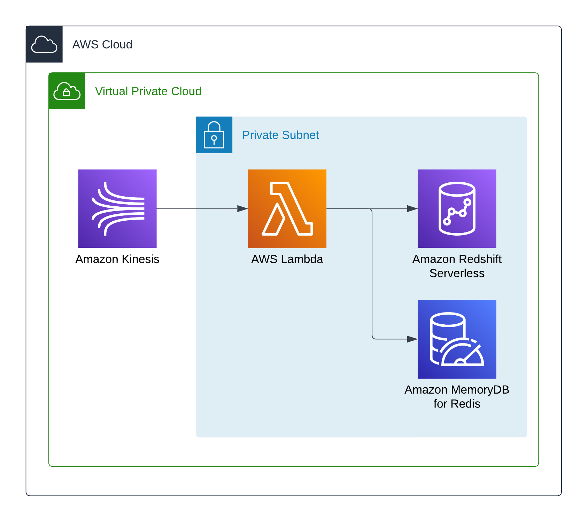

# Data Warehouse

Data Warehouse is an AWS project for real time data storage and analytics. The infrastructure is written in Terraform and the data ingestion application is written in Python.

## Architecture

The AWS architecture of the Data Warehouse is presented in the following schema.

## Get Started

For more information on how to get started with the Data Warehouse, visit the [Get Started](./documentation/get_started.md) guide in the documentation.
